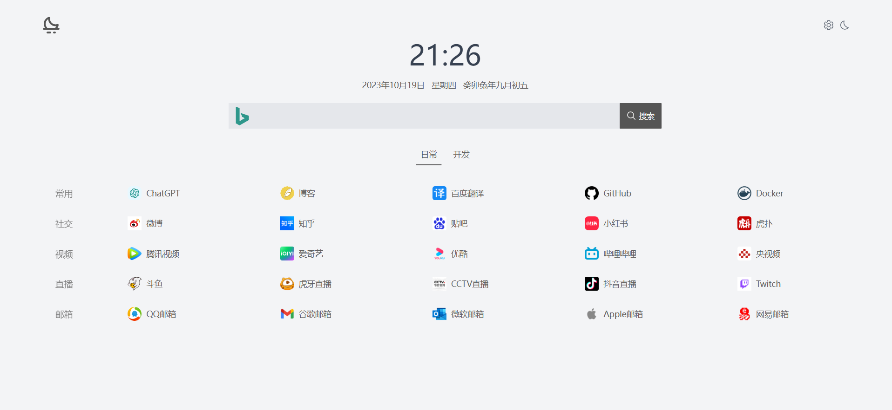

<div align="center">


<h1 align="center">简约风格的网址导航页</h1>

## 项目背景

由于个人服务器内存较小，默认 web-start 项目直接使用 vite preview 占用内存较大，所以将其重新构建为 alpine-nginx 方式

docker buildx build -t wangxian/web-start:latest -t wangxian/web-start:v1.1 --platform=linux/arm/v7,linux/arm64,linux/amd64,linux/386 -f Dockerfile-nginx . --push

### 手工构建
docker rmi -f wangxian/web-start:latest
docker build -t wangxian/web-start:latest -f Dockerfile-nginx .
docker run -it --rm wangxian/web-start:latest ls /app/public


[演示环境](https://www.luode.vip)



</div>

# 启动

## 安装依赖
```bash
npm install -g pnpm
pnpm install
```

## 启动项目
```bash
npm run dev
```

# docker容器

## latest 版本

```shell
docker pull luode0320/web-start:latest
```

启动:

```shell
docker run -d -p 2000:2000 luode0320/web-start:latest
```

挂载配置:
```shell
docker run -d \
--restart=always \
--name web  \
-p 2000:2000 \
-v /usr/local/src/web/preset.json:/app/src/preset.json
luode0320/web-start:latest
```
